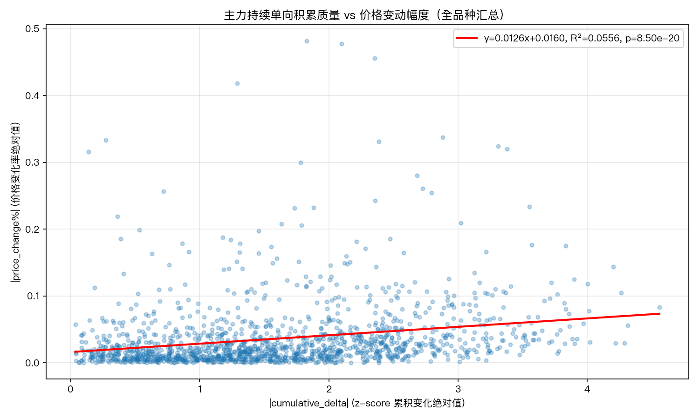
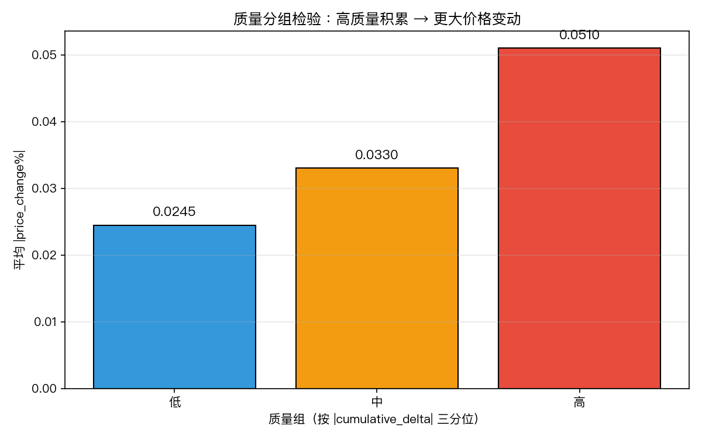
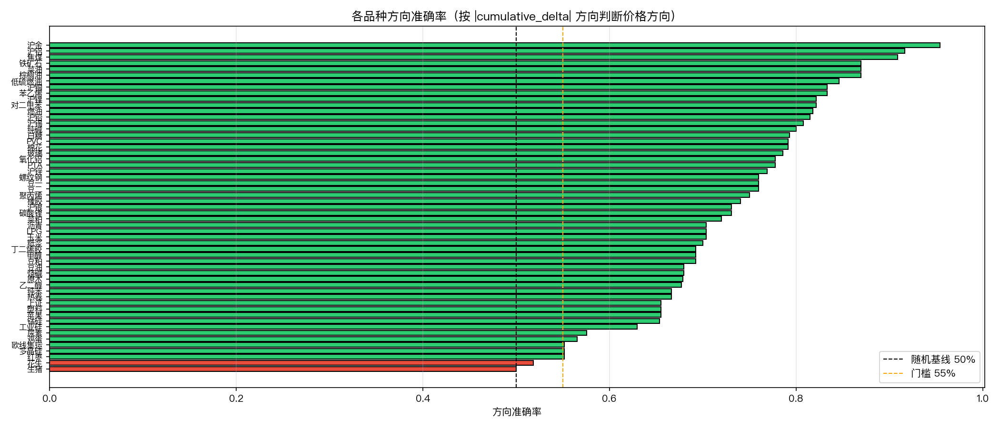

# 主力持续单向积累与期货价格变动幅度的关系验证报告

**品种范围**：全市场 55 个品种
**数据区间**：2025-07-22 ~ 2026-04-20（每品种 180 个交易日）
**报告日期**：2026-05-14

---

## 一、研究背景与核心假设

### 1.1 与 Plan 1 的关系

[Plan 1](../plan1/docs/report.md) 已验证：主力资金方向与期货价格方向一致性达 ~66%，散户反向对称成立。这是**定性**结论——方向是否一致。

本报告在此基础上进一步回答**定量**问题：

> **主力指数持续单向运动的时间越长、积累幅度越大，期货价格的变动就越大。**

即验证：**大趋势 = 主力资金的持续单向积累**

### 1.2 核心指标定义

| 指标 | 含义 |
|------|------|
| `main_force` | 基于大单委托统计的主力资金强弱 |
| `z_score` | `main_force` 在同品种历史中的 z-score 标准化值（品种内比较） |
| `diff2[t]` | `z_score[t] - z_score[t-2]`，用 2 日差过滤日间噪声 |
| **run（连续单调区间）** | 连续 `diff2` 同号（全正或全负）的交易日序列，duration ≥ 3 |
| `cumulative_delta` | run 期间 z-score 的净变化量（`end_z - start_z`） |
| `price_change%` | run 同期价格变化率 |

### 1.3 验证框架

三层检验：

1. **方向准确率**：做多 run 中价格上涨的比例、做空 run 中价格下跌的比例
2. **质量分组检验**：按 `|cumulative_delta|` 分低/中/高三组，比较 `|price_change%|`
3. **回归验证**：`|price_change%| ~ |cumulative_delta|`

---

## 二、全局总览

### 2.1 Run 识别结果

| 指标 | 数值 |
|------|------|
| 总 runs 数 | 1,452 |
| 做多 runs (+1) | 717 |
| 做空 runs (-1) | 735 |
| 平均 duration | 6.26 天 |
| duration 范围 | 3 ~ 21 天 |

每个品种平均识别到 ~26 个 runs，覆盖约 180 个交易日中的 ~160 天（存在重叠），说明市场大部分时间处于某种单向趋势中。

### 2.2 方向准确率

| 方向 | runs 数 | 方向准确率 |
|------|---------|-----------|
| 做多 runs | 717 | **73.36%** |
| 做空 runs | 735 | **71.97%** |
| **整体** | 1,452 | **72.66%** |

> **关键发现**：方向准确率 72.66%，显著高于 Plan 1 的 ~66%（S=3 滑窗）。
> 
> 这说明：**过滤出"连续单向运动"的区间后，主力方向的预测力大幅提升**（从 66% → 73%，提升 6.7 个百分点）。
> 换言之，"主力在做什么"比"主力在哪"更能判断价格方向——持续的积累才是有效信号。

### 2.3 质量分组检验（核心假设验证）

将所有 runs 按 `|cumulative_delta|`（z-score 累积变化绝对值）分为三等分：

| 质量组 | `|cumulative_delta|` 范围 | 平均 `|price_change%|` | 样本数 |
|--------|------------------------|---------------------|--------|
| **低** | 底部 1/3 | **2.45%** | 484 |
| **中** | 中间 1/3 | **3.30%** | 484 |
| **高** | 顶部 1/3 | **5.10%** | 484 |

**高质量组 vs 低质量组：价格变动幅度提升 108%**（5.10% / 2.45% - 1）。

三组单调递增，核心假设得到**强有力支持**。

### 2.4 回归验证

`|price_change%| ~ |cumulative_delta|`

| 指标 | 数值 |
|------|------|
| 斜率 | 0.0126 |
| R² | **0.0556** |
| p 值 | **8.50e-20** |

- p 值极显著，说明关系**统计上确实存在**
- R² = 5.56%，说明 `|cumulative_delta|` 能解释约 5.6% 的价格变动方差——考虑到期货市场影响因素众多，这一解释力在单因子框架中已属合理水平
- 斜率含义：`cumulative_delta` 每增加 1 个标准差，价格变动幅度增加约 1.26 个百分点

### 2.5 多空拆分

| 方向 | 斜率 | R² | p 值 |
|------|------|-----|------|
| 做多 runs | 0.0155 | 0.0679 | 1.35e-12 |
| 做空 runs | 0.0091 | 0.0412 | 2.78e-08 |

**做多 runs 的回归斜率显著大于做空 runs**（0.0155 vs 0.0091），说明：
- 主力持续做多的"质量"对价格上涨的推动更强
- 这与 Plan 1 中"跌侧同向率略高于涨侧"（66.3% vs 63.1%）形成有趣对比——Plan 1 看的是固定窗口内的方向一致性，Plan 3 看的是持续积累的幅度效应，两者揭示的是不同维度的规律

---

## 三、品种级分析

### 3.1 方向准确率排名（Top 15）

| 排名 | 品种 | 板块 | runs 数 | 做多准确率 | 做空准确率 | 整体准确率 | binom_p |
|------|------|------|---------|-----------|-----------|-----------|---------|
| 1 | **沪金** | 有色金属 | 22 | 100.0% | 90.9% | **95.5%** | <0.0001 |
| 2 | **沪铝** | 有色金属 | 24 | 100.0% | 83.3% | **91.7%** | <0.0001 |
| 3 | **焦煤** | 黑色系 | 22 | 83.3% | 100.0% | **90.9%** | 0.0001 |
| 4 | **铁矿石** | 黑色系 | 23 | 75.0% | 100.0% | **87.0%** | 0.0005 |
| 5 | **菜油** | 油脂油料 | 23 | 88.9% | 85.7% | **87.0%** | 0.0005 |
| 6 | **棕榈油** | 油脂油料 | 23 | 100.0% | 75.0% | **87.0%** | 0.0005 |
| 7 | **低硫燃油** | 化工能化 | 26 | 85.7% | 83.3% | **84.6%** | 0.0005 |
| 8 | **沪铜** | 有色金属 | 24 | 91.7% | 75.0% | **83.3%** | 0.0015 |
| 9 | **苯乙烯** | 化工能化 | 24 | 80.0% | 85.7% | **83.3%** | 0.0015 |
| 10 | **沪镍** | 有色金属 | 28 | 84.6% | 80.0% | **82.1%** | 0.0009 |
| 11 | **对二甲苯** | 化工能化 | 28 | 85.7% | 78.6% | **82.1%** | 0.0009 |
| 12 | **燃油** | 化工能化 | 22 | 76.9% | 88.9% | **81.8%** | 0.0043 |
| 13 | **沪铅** | 有色金属 | 27 | 84.6% | 78.6% | **81.5%** | 0.0015 |
| 14 | **沪锡** | 有色金属 | 26 | 91.7% | 71.4% | **80.8%** | 0.0025 |
| 15 | **纯碱** | 化工能化 | 30 | 75.0% | 85.7% | **80.0%** | 0.0014 |

### 3.2 未通过品种（准确率 < 55% 或 p ≥ 0.05）

| 品种 | 板块 | 整体准确率 | binom_p | 分析 |
|------|------|-----------|---------|------|
| 花生 | 油脂油料 | 51.9% | 1.0000 | 基本随机，无信号 |
| 生猪 | 农产品 | 50.0% | 1.0000 | 长侧准确率仅 15.4%，极度异常 |
| 欧线集运 | 其他 | 55.2% | 0.7111 | 与 Plan 1 一致，航运定价特殊 |
| 多晶硅 | 其他 | 55.2% | 0.7111 | 接近随机 |
| 红枣 | 农产品 | 55.2% | 0.7111 | 接近随机 |
| 鸡蛋 | 农产品 | 56.5% | 0.6776 | 边缘通过 |
| 尿素 | 化工能化 | 57.6% | 0.4869 | 边缘通过 |
| 工业硅 | 其他 | 63.0% | 0.2478 | 信号偏弱 |

**通过品种数：31 / 55（56.4%）**，门槛为准确率 ≥ 55% 且 binom_p < 0.05。

> 与 Plan 1 对比：Plan 1 通过 45/55（81.8%），Plan 3 通过 31/55（56.4%）。
> 
> **原因**：Plan 3 的检验更严格——不仅要求方向一致，还要求在"连续单调区间"这一更窄的场景下成立。能通过这一更高门槛的品种，其主力资金的"质量"信号更为可靠。

### 3.3 与 Plan 1 的品种排名对比

| 品种 | Plan 1 排名(S=3) | Plan 1 同向率 | Plan 3 排名 | Plan 3 准确率 | 变化 |
|------|-----------------|--------------|------------|-------------|------|
| 沪锡 | 1 | 72.4% | 14 | 80.8% | ↑ |
| 沪铅 | 2 | 72.4% | 13 | 81.5% | ↑ |
| 菜油 | 3 | 71.8% | 5 | 87.0% | ↑ |
| 沪金 | 4 | 71.8% | **1** | **95.5%** | ↑↑ |
| 焦煤 | 5 | 71.3% | 3 | 90.9% | ↑↑ |
| 沪铝 | 6 | 71.3% | 2 | 91.7% | ↑↑ |

**趋势**：Plan 1 头部品种在 Plan 3 中几乎全部保持或提升排名，说明这些品种的主力资金不仅方向判断准确，其"持续积累"的量化特征也显著驱动价格变动。

---

## 四、板块分析

| 板块 | 品种数 | 平均方向准确率 | 平均回归 R² | 特征 |
|------|--------|-------------|------------|------|
| **有色金属** | 9 | **82.5%** | 0.2079 | 最强板块，全部品种通过，沪金/沪铝/沪镍/沪铜 R² 均 > 0.1 |
| **黑色系** | 5 | **77.2%** | 0.2793 | 铁矿石 R² 高达 0.49，板块内一致性最好 |
| **化工能化** | 18 | **73.5%** | 0.1191 | 品种最多，纯碱/苯乙烯/玻璃 R² 突出（>0.25） |
| **油脂油料** | 8 | **73.4%** | 0.2792 | 菜油/棕榈油 R² > 0.39，但花生失效 |
| **其他** | 8 | **66.0%** | 0.2967 | 分化最大，玻璃 R²=0.59 但原木/上证/工业硅偏弱 |
| **农产品** | 7 | **65.2%** | 0.1571 | 整体最弱，棉花/白糖表现尚可但生猪/鸡蛋/红枣偏弱 |

> **有色金属**延续了 Plan 1 的强势地位，且优势进一步扩大（Plan 1 平均同向率 69.5%，Plan 3 平均准确率 82.5%）。
>
> **农产品**在 Plan 3 中进一步走弱，说明这些品种的主力资金虽有方向一致性，但"持续单向积累"的特征不明显，价格受季节性/政策因素干扰更大。

---

## 五、核心图表

### 5.1 散点图：质量 vs 价格变动幅度

- x 轴：`cumulative_delta` 绝对值（z-score 累积变化）
- y 轴：同期 `price_change%` 绝对值
- 红色拟合线：斜率 = 0.0126，R² = 0.0556，p < 0.0001

### 5.2 质量分组柱状图

低质量组（平均 |price_change%| = 2.45%）→ 中质量组（3.30%）→ 高质量组（5.10%），**单调递增**，高质量组是低质量组的 **2.08 倍**。

### 5.3 各品种方向准确率

绿色 = 通过（≥55%），红色 = 未通过。沪金、沪铝、焦煤、铁矿石等头部品种准确率显著领先。

---

## 六、综合结论

### 6.1 核心假设：强烈成立

**大趋势 = 主力资金的持续单向积累**

三个层面的验证均支持该假设：

1. **方向层面**：整体方向准确率 **72.66%**，远超随机基线 50%，且高于 Plan 1 的固定滑窗结果（~66%）
2. **幅度层面**：高质量组 vs 低质量组的价格变动幅度提升 **108%**（5.10% vs 2.45%）
3. **统计层面**：回归斜率显著为正（p = 8.50e-20），`cumulative_delta` 每增加 1 标准差，价格变动增加约 1.26 个百分点

### 6.2 关键洞察

**"持续"比"方向"更有价值**

Plan 1 告诉我们主力方向和价格方向一致（66%）。Plan 3 告诉我们：当我们进一步筛选出"主力在**持续**单向积累"的区间时，方向准确率提升到 **72.66%**，且积累的幅度直接转化为价格变动的幅度。

这意味着：**不是"主力在买就会涨"，而是"主力持续在买才会大涨"**。间歇性的、碎片化的主力行为对价格推动有限；只有形成"持续单向积累"的动能，才会产生显著的趋势性价格变动。

### 6.3 与 Plan 1 的递进关系

| 维度 | Plan 1 | Plan 3 | 递进 |
|------|--------|--------|------|
| 问题 | 方向是否一致？ | 持续积累是否驱动大趋势？ | 定性 → 定量 |
| 方法 | 固定滑窗 S=2,3,4 | 数据驱动的连续单调区间 | 被动 → 主动识别 |
| 方向准确率 | ~66% | **72.66%** | 提升 6.7pp |
| 新发现 | 无 | 质量越高，价格变动越大 | 新增幅度规律 |
| 板块强弱 | 有色金属最强 | 有色金属优势扩大 | 一致性验证 |

### 6.4 应用启示

1. **信号过滤**：在交易信号中，优先选择 `diff2` 连续同号 ≥3 天的品种，过滤掉震荡/噪音区间
2. **仓位管理**：`cumulative_delta` 的大小可作为仓位参考——高质量 run 对应更大的潜在价格变动
3. **止损参考**：如果进入了一个高质量 run 但价格反向运动，说明信号失效概率较高，应更果断止损
4. **品种池**：优先关注有色金属（准确率 82.5%）和黑色系（77.2%），农产品和"其他"板块需谨慎

### 6.5 局限与下一步

1. **R² 偏低（5.56%）**：`cumulative_delta` 单独解释力有限，需结合其他因子（如成交量、波动率、散户反向信号）构建复合模型
2. **run 间可能重叠**：相邻 run 的数据窗口存在部分重叠，可能影响独立性假设
3. **样本外验证**：当前结论基于 2025-07 ~ 2026-04 的 180 个交易日，需在更长周期和不同市场环境下验证稳定性

---

## 附：交付物清单

| 文件 | 内容 |
|------|------|
| [artifacts/data/runs_all.csv](../artifacts/data/runs_all.csv) | 1,452 个 run 的完整明细 |
| [artifacts/data/runs_summary.csv](../artifacts/data/runs_summary.csv) | 55 品种汇总统计（方向准确率、回归参数） |
| [artifacts/charts/scatter_quality_vs_price_change.png](../artifacts/charts/scatter_quality_vs_price_change.png) | 散点图：质量 vs 价格变动 |
| [artifacts/charts/bar_quality_groups.png](../artifacts/charts/bar_quality_groups.png) | 分组柱状图：低/中/高质量 |
| [artifacts/charts/bar_direction_accuracy.png](../artifacts/charts/bar_direction_accuracy.png) | 品种方向准确率排名 |
| [scripts/detect_runs.py](../scripts/detect_runs.py) | Run 识别脚本 |
| [scripts/analyze_runs.py](../scripts/analyze_runs.py) | 统计分析脚本 |
