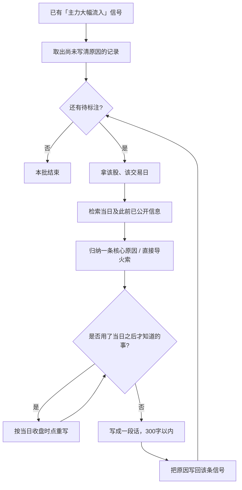

```mermaid
flowchart TD
    A[已有「主力大幅流入」信号] --> B[取出尚未写清原因的记录]
    B --> C{还有待标注?}
    C -->|否| Z[本批结束]
    C -->|是| D[拿该股、该交易日]
    D --> E[检索当日及此前已公开信息]
    E --> F[归纳一条核心原因 / 直接导火索]
    F --> G{是否用了当日之后才知道的事?}
    G -->|是| H[按当日收盘时点重写]
    H --> G
    G -->|否| I[写成一段话，300字以内]
    I --> J[把原因写回该条信号]
    J --> C
```

业务含义：

1. **输入**：库里已筛出的主力大幅流入信号；原因还空着，或只写了「初筛…」。
2. **要回答的问题**：这一天这只股票为什么被主力大幅买入——只找最关键的一条导火索。
3. **依据**：只能用该交易日当天及之前已经公开的信息，站在当日收盘解释盘中流入。
4. **产出**：一段中文原因，写回同一条信号的 `reason`。
